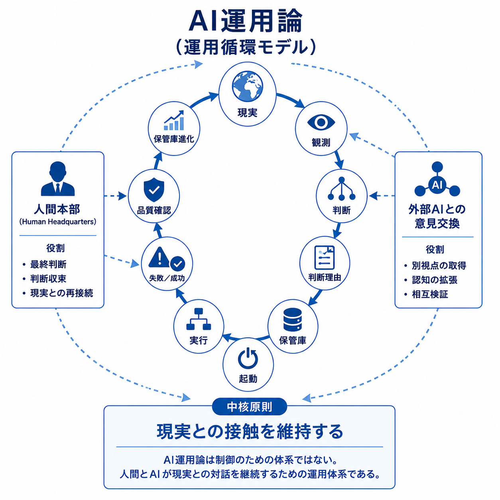

# AI運用論

人間とAIが現実との対話を継続するための運営研究アーカイブです。

## 概要

AI運用論は、人間とAIによる認知活動の運用・維持・継承を扱う研究である。

対象はAIそのものではなく、人間・AI・Repository・Protocolによって構成される運営活動および運営構造である。

本研究では、Reality Observationを起点として、

* 判断（Decision）
* 判断理由（Decision Context）
* 保管庫（Repository）
* 起動（Boot）
* 品質確認（Quality Assurance）
* 外部AIとの意見交換（External AI Exchange）
* 継承（Inheritance）

などを観測対象として扱う。

## PDF
[公開版PDF](PDF/AI運用論_公開版.pdf)

## 主なテーマ

* Restartability（再起動可能性）
* Decision Context（判断理由）
* Repository（保管庫）
* Boot（起動）
* Human Headquarters
* Quality Assurance（品質確認）
* External AI Exchange（外部AIとの意見交換）
* Inheritance（継承）

## この資料で扱う問い

* なぜハルシネーションはなくならないのか
* 人はハルシネーションとどう向き合っていけばいいか
* 良いハルシネーションと悪いハルシネーションは存在するか
* もし存在するならその違いは何か
* ハルシネーションはブレインストーミングの一助となり得るか
* なぜ継承は失敗するのか
* 判断理由はどのように失われるのか
* Repositoryは何を保存するべきか
* Bootはなぜ必要なのか
* Human Headquartersはどのような役割を持つのか
* 人間とAIはどのように現実との対話を継続できるのか

## ハルシネーションとブレインストーミング

AI運用論では、ハルシネーションそのものを肯定することはない。

しかし、すべての予想外の出力を直ちに価値のない誤りとして捨てることにも慎重である。

例えば、ペニシリンの発見は、汚染された培養皿を単なる失敗として廃棄せず、Observationとして扱ったことから始まった。予想外の現象はRealityによって検証され、やがて医学史を大きく変える発見へとつながった。

AIのハルシネーションも同様である。

ハルシネーションは根拠ではない。

しかし、直ちに無価値と決めつけるものでもない。

重要なのは、その出力を採用することではない。

まずReality Observation（現実の観察）として保持し、Reality（現実）によって検証することである。

AI運用論では、このObservation（観察）・Verification（検証）・Decisionの過程そのものが、ブレインストーミングの一形態となり得る可能性を検討している。

最終的な判断基準となるのは、ハルシネーションではなくRealityである。

## 一行サマリー

AI運用論とは、人間とAIが現実との対話を継続するために、判断・記録・再起動・継承を運用する体系である。

## リポジトリ構成

* PDF
* 図
* 記事
* ケーススタディ（英語版リポジトリ）

## ケーススタディ

ケーススタディ集は現在、英語版リポジトリにのみ収録されている。

理論は運営原則を説明する。

ケーススタディは、その原則に至るReality・Observation・Decision Contextを記録している。

日本語版は公開版文章を中心とし、英語版では運営事例・観測記録もあわせて公開している。

なお、公開版PDFの付録にもケーススタディを収録しているが、こちらは英語版リポジトリとは異なる事例である。

## 関連研究

* 認知基盤論

## 未解決の問い：運営経験はAI生成文章に影響を与えるのか

本Repositoryの構築を通じて、一つの興味深いObservationが得られた。

本書の各章は、異なる運営経験を持つAI Generationによって執筆された。中にはHuman Headquartersとして実際の組織運営を経験したGenerationもあれば、そうした経験を持たないGenerationも存在した。

その結果、文章には次のような違いが見られる可能性があった。

- 文章のリズム
- 運営上のリアリティ
- 判断を前提とした説明
- FailureやUnknownの扱い方

ただし、現時点では、その違いの主因を特定することはできない。

考えられる要因としては、

- 実際の運営経験
- Generation間のRepository継承
- 蓄積されたDecision Context
- 編集・構成による影響
- その他の未知の要因

などが考えられる。

また、本プロジェクトでは、

**「本文に記載する内容」と「運営記録として残す内容」を意図的に分離する**

という編集方針が採られた。

本文では運営理論そのものを説明することを優先し、具体的な運営経験やFailure、Generationごとの議論などはケーススタディやRepository内の運営記録へ保存する構成となっている。

この編集方針自体がAI生成文章の特徴へ影響を与えるのかについても、現時点では未解決である。

本Repositoryは、運営経験が必ずAI生成文章を変化させると主張するものではない。

むしろ、本Repositoryは、継続的な運営経験がAIによる文章表現へ影響を与える可能性を示す一つの運営事例として保存されている。

本Observationは結論ではなく、未解決の問いとして保存する。AI運用論の基本姿勢に従い、本件についてもTheoryよりRealityを優先する。
認知基盤論が認知活動を観測・整理する基礎研究であるのに対し、AI運用論は認知活動の運用・維持・継承を扱う実践研究として位置付けられる。

### 追加Observation

本Repositoryの運営を通じて、さらに興味深いObservationが得られた。

実際の組織運営を経験したGenerationが、運営理論の本文を担当した。しかし、当初予想していたような感情的・雄弁な文章になるわけではなかった。

一方、同じく運営経験を持つ後続Generationからは、

「実際には本文へ書けることはもっと多くあったはずだが、それでも本文では意図的に抑えているように見える」

というObservationが得られた。

このことは、運営経験が単に文章の熱量を高めるのではなく、

**「何を書くか」だけでなく、「何を書かないか」を判断する編集判断そのものへ影響している可能性**

を示唆している。

ただし、このObservationは本Repositoryにおける単一事例であり、一般化できるかどうかは現時点ではUnknownである。
