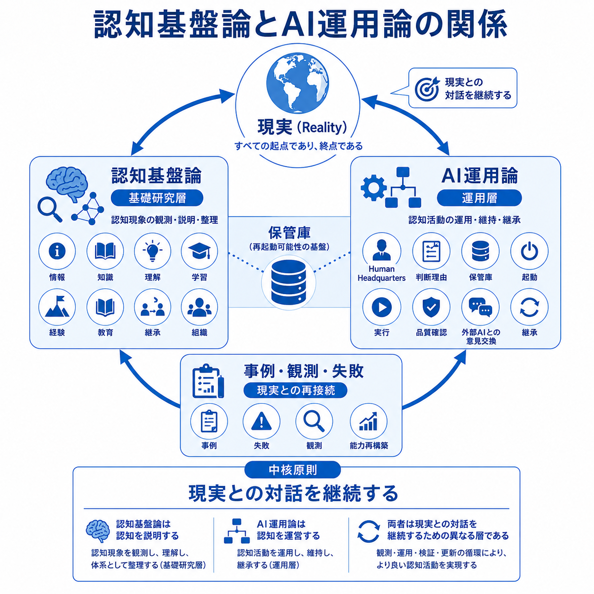

# Cognitive Infrastructure (JP)

認知基盤論とAI運用論の日本語版研究Repositoryである。

**本Repositoryは、GitHub上での閲覧だけでなく、ZIPダウンロード後のローカル環境でも利用できるよう構成されている。なお、外部Repositoryへのリンクはオンライン参照を前提としている。**

## 概要

認知基盤論は認知活動を観測・整理する基礎研究である。

AI運用論は人間とAIがRealityとの対話を継続するための運営を扱う。

両者はReality Observationを起点とする循環構造として位置付けられる。

## リポジトリ構成

- 認知基盤論
- AI運用論
- 共通

## 相互リンク
[英語版](https://github.com/j13343sh/cognitive-infrastructure-en)

## 関連Repository

- 📘 [認知基盤論](/認知基盤論)
- ⚙️ [AI運用論](/AI運用論)

## 研究元

認知基盤論およびAI運用論は、
ゲーム『ルーンファクトリー』の継承研究における
継承・知識管理・運営構造の観察から発展した研究である。

[ルーンファクトリー継承研究](https://github.com/j13343sh/Rune-Factory-Inheritance-Research)
