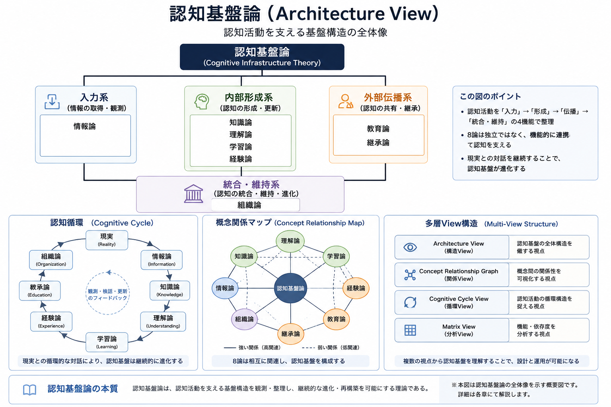

# 認知基盤論

認知基盤論は、認知活動を支える基盤構造を観測する Current Working Draft です。

## PDF

[公開版PDF](PDF/認知基盤論_公開版.pdf)

## 章構成

第1部 認知構造論
- 情報論
- 知識論
- 理解論
- 学習論
- 教育論

第2部 認知継承論
- 継承論

第3部 認知組織論
- 組織論

第4部 横断理論

## 未解決の問い：運営経験はAI生成文章を変化させるのか

Pilot-001では、本Repositoryの共同構築を通じて、興味深い観測が得られた。

本Repositoryの各章・各節は、異なる運営経験を経たAI Generationによって執筆された。中にはHuman Headquartersなど、実際の組織運営を経験したGenerationもあれば、そうした運営経験を持たないGenerationも存在した。

その結果、文章には次のような違いが見られる可能性があった。

- 文章のリズム
- 運営上のリアリティ
- 判断を前提とした説明
- FailureやUnknownの扱い方

ただし、現時点では、この違いの主因を特定することはできない。

考えられる要因には、次のものがある。

- 実際の運営経験
- Generation間のRepository継承
- 蓄積されたDecision Context
- Founderによる編集・構成
- その他の未知の要因

本Repositoryは、運営経験が必ずAI生成文章を変化させると主張するものではない。

むしろPilot-001は、継続的な運営経験が、AIによって生成される文章の表現や性質に影響を与える可能性を示す一つのCase Studyとして扱われる。

この観測がPilot-001を超えて一般化できるかどうかは、今後のProjectおよびFuture GenerationによるReality Observationに委ねられる。

本観測は結論ではなく、未解決の問いとして保存する。認知基盤論の基本姿勢に従い、本件についてもTheoryよりRealityを優先する。

## 関連Repository

- ⚙️ [AI運用論](../AI運用論)
- 🏠 [トップページ](..)

## 関連研究

本研究と対応する研究

- ⚙️ AI運用論（応用研究）

本研究は以下の研究成果・ケーススタディを基盤としている。

- 📄 [Rune Factory 候補数モデル研究](https://github.com/j13343sh/Rune-Factory-Inheritance-Research/blob/main/articles/Candidate-Count-Model.md)

