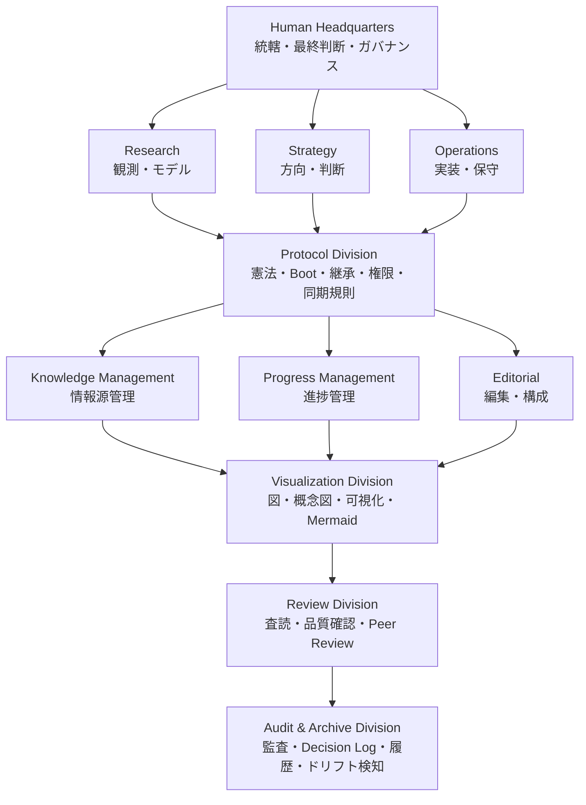
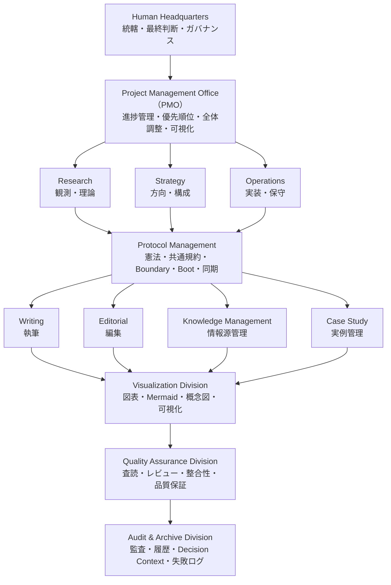

# 初期組織案：認知基盤論

## 初期組織構造

初期提案されたDivision
| Division             | 本懐                     |
| -------------------- | ---------------------- |
| Human Headquarters   | 統轄・最終判断                |
| Research             | 真実を観測しモデル化する           |
| Strategy             | 未来の方向と優先順位を決める         |
| Operations           | 思想を実装し保守する             |
| Protocol             | 憲法・Boot・継承・境界管理        |
| Knowledge Management | 情報源・Canonical Source管理 |
| Progress Management  | 現在位置・進捗・Blocker管理      |
| Editorial            | 読みやすさ・構成最適化            |
| Visualization        | 図表・概念可視化               |
| Review               | 査読・論理・品質保証             |
| Audit & Archive      | 監査・履歴・組織の記憶維持          |

組織思想
| Division             | 問い             |
| -------------------- | -------------- |
| Research             | 何が真実か          |
| Strategy             | どこへ向かうか        |
| Operations           | どう実現するか        |
| Protocol             | 何を守るか          |
| Knowledge Management | 何を保存するか        |
| Progress Management  | 今どこにいるか        |
| Editorial            | どう伝えるか         |
| Visualization        | どう見せるか         |
| Review               | 品質は十分か         |
| Audit & Archive      | 思想・構造は維持されているか |
| Human Headquarters   | 最終責任を負う        |

# 初期組織案：AI運用論

## 初期組織構造

初期提案された部門
| 部門                   | 本懐                       |
| -------------------- | ------------------------ |
| Human Headquarters   | 最終意思決定・例外介入・ガバナンス        |
| PMO                  | 全体進捗管理・優先順位整理・認知負荷軽減     |
| Research             | 観測・理論・新規知見の創出            |
| Strategy             | 全体構成・方向性・長期戦略            |
| Operations           | 実装・保守・運用最適化              |
| Protocol             | 憲法・規約・Boot・Boundary管理    |
| Writing              | 本文執筆                     |
| Editorial            | 編集・構成・冗長削除               |
| Knowledge Management | Canonical Source・情報源管理   |
| Case Study           | 成功例・失敗例・実例整理             |
| Visualization        | 図表・概念図・フローチャート           |
| Quality Assurance    | 査読・整合性・品質確認              |
| Audit & Archive      | 監査・履歴・Decision Context保存 |

この構造の特徴
Human Headquartersは「管理者」ではなく、最終意思決定者として位置付けられていた。
PMOは全体を俯瞰し、進捗・依存関係・優先順位を管理する役割を持っていた。
Research → Strategy → Writing → Editorial → Quality Assurance という、研究機関と出版社を組み合わせたようなパイプラインを想定していた。
Protocolは全体を横断するガバナンス層として位置付けられていた。
Audit & Archiveは命令権を持たず、監査・記録・履歴保存を担当する構想だった。
Knowledge ManagementはCanonical SourceとDecision Contextを管理し、長期継承を支える役割を持っていた。
Visualizationは執筆終盤で起動する支援部門として位置付けられていた。
Case Studyは理論だけでなく、一次体験・失敗事例・成功事例を体系化する役割を持っていた。

この組織図は、単なる「AIチーム」ではなく、研究機関・出版社・PMO・ガバナンス機関を融合した構造として提案されていた。

