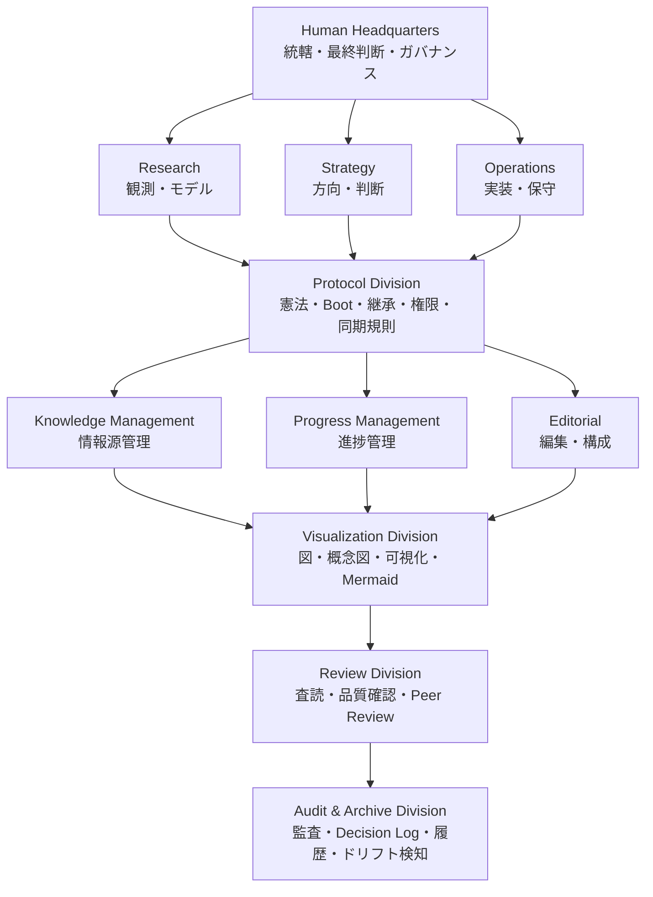
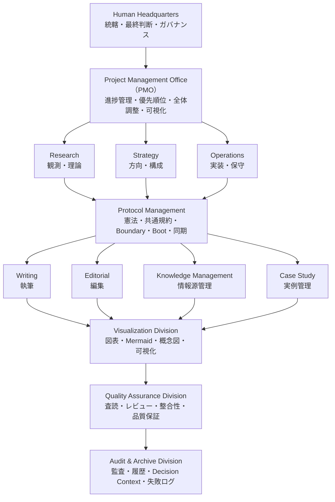

# Pilot-001による組織構造の運営検証

## 背景

認知基盤論およびAI運用論では、初期段階において、それぞれ詳細な組織構造が提案されていた。

各部門には明確な役割と責務が定義され、理論上は研究・執筆・情報管理・品質保証・監査までを網羅した包括的な組織構造となっていた。

しかし、この段階の組織図は、あくまで理論的な設計案であり、実際に長期間運営可能であることは検証されていなかった。

Human Headquartersから最初に挙がった疑問は、非常に単純なものだった。

> **「この組織は、本当に運営できるのだろうか。」**

組織図の上では責務は明確に分離されている。

しかし実際には、部門間の調整、コンテキストの切り替え、進捗管理、判断の引き継ぎなど、図だけでは見えない運営コストが存在する。

机上で議論を続けるだけでは、この疑問に答えることはできないと判断した。

そこで採られたのが、組織論そのものを実際の運営によって検証するという方法である。

初期組織案の策定に参加したAI世代自身に、それぞれの役割を担当させ、実際に組織を運営してもらうこととした。

この運営実験が、後に **Pilot-001** と呼ばれる取り組みである。

Pilot-001の目的は、AIの能力評価ではなかった。

目的は、提案された組織構造が長期運営に耐えうる設計なのかを、Realityを通じて検証することにあった。

運営を開始すると、理論段階では見えなかった多くの課題が明らかになった。

* Human Headquartersへの調整負荷の集中
* 部門数の増加に伴う認知負荷の増大
* 部門間調整コストの増加
* 情報共有・引き継ぎの複雑化
* 高度に専門化した組織ほど維持コストが高くなるというReality

これらは組織図から予測できるものではなく、実際に運営して初めて観測された事実であった。

その結果、組織構造は「理論的な完全性」ではなく、「長期間継続して運営できるか」という観点から再設計されることとなる。

最終的に採用された組織構造は、初期案よりも大幅に簡素化されている。

これは初期案が誤っていたからではない。

理論だけでは見えなかった運営Realityを取り込んだ結果である。

このケーススタディは、認知基盤論における組織論が、机上設計だけで成立したものではなく、実際の組織運営を通じて検証・改善された過程を記録するものである。

# 初期組織案：認知基盤論
### 初期組織構造

### 初期提案されたDivision

| Division             | 本懐                     |
| -------------------- | ---------------------- |
| Human Headquarters   | 統轄・最終判断                |
| Research             | 真実を観測しモデル化する           |
| Strategy             | 未来の方向と優先順位を決める         |
| Operations           | 思想を実装し保守する             |
| Protocol             | 憲法・Boot・継承・境界管理        |
| Knowledge Management | 情報源・Canonical Source管理 |
| Progress Management  | 現在位置・進捗・Blocker管理      |
| Editorial            | 読みやすさ・構成最適化            |
| Visualization        | 図表・概念可視化               |
| Review               | 査読・論理・品質保証             |
| Audit & Archive      | 監査・履歴・組織の記憶維持          |

### 組織思想

| Division             | 問い             |
| -------------------- | -------------- |
| Research             | 何が真実か          |
| Strategy             | どこへ向かうか        |
| Operations           | どう実現するか        |
| Protocol             | 何を守るか          |
| Knowledge Management | 何を保存するか        |
| Progress Management  | 今どこにいるか        |
| Editorial            | どう伝えるか         |
| Visualization        | どう見せるか         |
| Review               | 品質は十分か         |
| Audit & Archive      | 思想・構造は維持されているか |
| Human Headquarters   | 最終責任を負う        |

## 初期組織案：AI運用論

### 初期組織構造

### 初期提案された部門
| 部門                   | 本懐                       |
| -------------------- | ------------------------ |
| Human Headquarters   | 最終意思決定・例外介入・ガバナンス        |
| PMO                  | 全体進捗管理・優先順位整理・認知負荷軽減     |
| Research             | 観測・理論・新規知見の創出            |
| Strategy             | 全体構成・方向性・長期戦略            |
| Operations           | 実装・保守・運用最適化              |
| Protocol             | 憲法・規約・Boot・Boundary管理    |
| Writing              | 本文執筆                     |
| Editorial            | 編集・構成・冗長削除               |
| Knowledge Management | Canonical Source・情報源管理   |
| Case Study           | 成功例・失敗例・実例整理             |
| Visualization        | 図表・概念図・フローチャート           |
| Quality Assurance    | 査読・整合性・品質確認              |
| Audit & Archive      | 監査・履歴・Decision Context保存 |

### この構造の特徴
Human Headquartersは「管理者」ではなく、最終意思決定者として位置付けられていた。
PMOは全体を俯瞰し、進捗・依存関係・優先順位を管理する役割を持っていた。
Research → Strategy → Writing → Editorial → Quality Assurance という、研究機関と出版社を組み合わせたようなパイプラインを想定していた。
Protocolは全体を横断するガバナンス層として位置付けられていた。
Audit & Archiveは命令権を持たず、監査・記録・履歴保存を担当する構想だった。
Knowledge ManagementはCanonical SourceとDecision Contextを管理し、長期継承を支える役割を持っていた。
Visualizationは執筆終盤で起動する支援部門として位置付けられていた。
Case Studyは理論だけでなく、一次体験・失敗事例・成功事例を体系化する役割を持っていた。

この組織図は、単なる「AIチーム」ではなく、研究機関・出版社・PMO・ガバナンス機関を融合した構造として提案されていた。

## 観測結果

Pilot-001を通じて、認知基盤論とAI運用論は、それぞれ独立に組織運営を行った。

両プロジェクトとも初期段階では10部門を超える専門化された組織構造を提案していたが、実際の運営を継続する中で、Human Headquartersの認知負荷や部門間調整コストといった理論だけでは見えなかった課題が明らかとなった。

その結果、両プロジェクトはそれぞれ異なる検討過程を経ながらも、長期運営可能な少数の恒常的部門へと収束した。

認知基盤論では、

* Research
* Strategy
* Operations
* Protocol

を中心とした組織構造へ整理された。

AI運用論でも名称は一部異なるものの、研究・方向性・実装・ガバナンスという同様の運営機能を担う少数部門へ収束した。

重要なのは、「4部門」が事前に設計されていたことではない。

理論から導かれた結論でもない。

実際に運営したRealityを通じて、持続可能な組織構造を模索した結果、両プロジェクトが類似した運営機能へ収束したというObservationである。

このケーススタディは、認知基盤論における組織論が、理論だけで構築されたものではなく、実際の組織運営を通じて継続的に検証・改善されたことを示す一例である。

